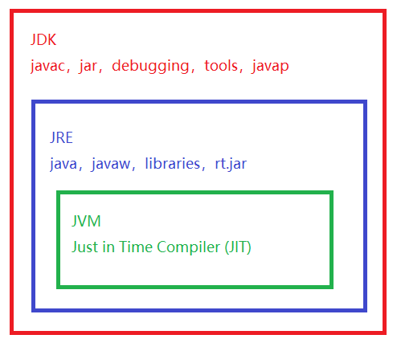

# Introduction

Java三个版本：

- JavaSE(Java Standard Edition)：标准版，定位在个人计算机上的应用
- JavaEE(Java Enterprise Edition)：企业版，定位在服务器端的应用
- JavaME(Java Micro Edition)：微型版，定位在消费性电子产品上的应用

Java的优势：

- 跨平台、可移植性
- 分布式
- 多线程

Java应用程序运行机制

首先利用文本编辑器变小Java源程序，源文件的后缀名为 __.java__ ，再利用编译器（javac）将源程序编译成字节码文件，字节码文件后缀名为 __.class__ ，最后利用虚拟机（解释器，java）解释执行

```java
源文件(.java) ---- Java编译器 ----> 字节码文件(.class) ---- Java虚拟机 ----> 解释执行
```

JVM、JRE、JDK

- JVM（Java Virtual Machine）Java虚拟机，用于执行字节码的“虚拟计算机”
- JRE（Java Runtime Environment）Java运行时环境，包含Java虚拟机、库函数、运行Java的应用程序所必须的文件
- JDK（Java Development Kit）Java开发工具包，包含JRE，以及增加编译器和调试器等用于程序开发的文件



## 第一个Java程序

```java
public class Hello{
    public static void main(String[] args){
        System.out.println("Hello World!\n");
    }
}
```

```shell
javac Hello.java # 编译
java Hello # 运行
```

说明：

- Java区分
- public被称作访问修饰符，用于控制程序的其他部分对这段代码的访问级别
- class 关键字，类。Java是面向对象编程语言，所有代码必须位于类里面
- 一个源文件至多只能声明一个public类，其他类的个数不限，如果源文件包含一个public类，源文件名必须和其中定义的public类名相同，其以 __.java__ 为扩展名
- 一个源文件可以包含多个类class
- 正确编译后的源文件，会得到相应的字节码文件，编译器为每个生成独立的字节码文件，且将字节码文件自动命名为类的名字且以 __.class__ 为扩展名
- main方法是Java程序的入口方法，它有固定的书写格式
- 花括号划分程序的各个部分，任何方法的代码都必须以 __{__ 开始，以 __}__ 结束
- Java中每个语句必须以分号结束，回车不是语句结束的标志，所以一个语句可以跨多行