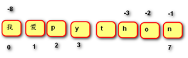

# Container

## Python容器类型

| 容器类型      | 表示方法                        | 类型   |      | 建   | 增   | 删   | 改   | 查   |
| ------------- | ------------------------------- | ------ | ---- | ---- | ---- | ---- | ---- | ---- |
| __str__       | `' '` `" "` `''' '''` `""" """` | 不可变 | 有序 | √    |      |      |      |      |
| __list__      | `[ ]`                           | 可变   | 有序 | √    | √    | √    | √    | √    |
| __tuple__     | `( )`                           | 不可变 | 有序 | √    |      |      |      | √    |
| __dict__      | `{ }`                           | 可变   | 无序 | √    | √    | √    | √    | √    |
| __set__       | `set()`                         | 可变   | 无序 | √    | √    | √    |      |      |
| __frozenset__ | `frozenset()`                   | 不可变 | 无序 | √    |      |      |      |      |
| __bytes__     | `b' '`                          | 不可变 | 有序 | √    |      |      |      | √    |
| __bytearray__ | `bytearray(b' ')`               | 可变   | 有序 | √    | √    | √    | √    | √    |


## 运算符

| 运算符                      | 说明                                                         |
| --------------------------- | ------------------------------------------------------------ |
| `+ 容器`                    | 拼接两个容器                                                 |
| `* 整数`                    | 重复生成容器元素                                             |
| `+= 容器`                   | 原容器与右侧容器进行拼接：对于不可变容器，会创建新容器，并改变变量绑定关系；对于可变容器，会将右侧容器追加到原有容器中，不改变绑定关系 |
| `*= 整数`                   | 重复生成容器元素，可能改变变量绑定关系                       |
| `<` `<=` `>` `>=` `==` `!=` | 比较运算符，依次比较两个容器中的元素，一旦不同则返回结果，字符的比较是比较**编码值** |


## 成员运算

判断容器中是否包含指定数据，返回bool类型

```python
数据 in 容器
数据 not in 容器

'a' in 'abcde'
1 not in [1, 2, 3, 4, 5]
```


## 索引



访问容器元素

```python
容器[索引]  # 索引为整数

s = 'hello world'
s[0]  # 'h'
s[-1]  # 'd'
s[20]  # error
```

说明：

- 正向索引从 **0** 开始，第二个索引为 **1** ，最后一个是 **len(容器)-1**

- 反向索引从 __-1__ 开始，**-1** 代表最后一个，**-2** 代表倒数第二个，第一个是**-len(容器)**


## 切片

从容器中取出相应的元素重新组成一个容器

```python
容器[ 开始索引 : 结束索引 : 步长 ]

s = 'abcde'
s[1:4]  # 'bcd'
s[1:]  # 'bcde'
s[:2]  # 'ab'
s[:]  # 'abcde'
s[4:2]  # ''
s[2:100]  # 'cde'
s[1:4:2]  # 'bd'
s[::2]  # 'ace'
s[::-1]  # 'edcba'
s[-4:-1]  # 'bcd'
s[-1:-4]  # ''
s[-1:-4:-1]  # 'edc'
```

说明：

- 不包括结束索引位置的元素

- 步长是切片每次获取完当前元素后移动的偏移量

- 正向切片(**步长为** **正**)，省略开始索引，默认为0，省略结束索引，默认为最后(包含)

- 反向切片(**步长为** **负**)，省略开始索引，默认为-1，省略结束索引，默认为第一个元素(包含)


## 内建函数

| 函数      | 说明                                     |
| --------- | ---------------------------------------- |
| len(容器) | 返回容器长度                             |
| sum(容器) | 返回容器所有元素的累加和(元素必须是数值) |
| max(容器) | 返回容器中最大的元素                     |
| min(容器) | 返回容器中最小的元素                     |


## 容器排序函数

| 函数                             | 说明                                                         |
| -------------------------------- | ------------------------------------------------------------ |
| reversed(seq)                    | 返回原序列的反向顺序的可迭代对象，不改变原序列               |
| sorted(iterable, reversed=False) | 返回原序列对象排序后的列表，reverse默认为False，会生成一个新序列，不改变原序列 |

