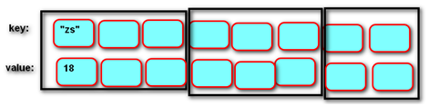

# dict 字典

## 定义

由一系列 **键** **(key) -** **值** **(value)** **对**组成的**可变** **映射**容器



说明：

- 映射(哈希算法)：通过键对应值，每条记录无序，没有先后顺序

- **键必须唯一且不可变对象** **(** **字符串、数字、元组** **)**，值没有限制

- 字典中每个数据都**只能用键进行索引**，而不能用下标进行索引

表示方法：用 **{}** 括起来，用**：**分隔键值对，键值对用**，**分隔

```python
# 空字典
{}
#非空字典
{'name' : 'cm', 'age' : 20}
{1 : '一', 2 : '二'}
```


## 字典基础操作

```python
# 创建
# 创建空字典
{}
# 创建非空字典
{key01:value01, key02:value02}
{'name':'zhangsan', 'age':20}

# 字典构造函数
# dict()
# 创建空字典
dict()
# 用可迭代对象创建字典, 必须能清楚的表示键值对
dict(iterable)
d = dict('ab', (1, 2), [3, 4], "CD")
d = {'a':'b', 1:2, 'C':'D', 3:4}
# 用关键字传参创建字典，自用于字符串作为键的情况
d=dict('name' = 'cm', 'age' = 20)
d= {'name':'cm', 'age':20}


# 字典索引
# 用 [] 运算符可以获取字典键对应的值，可以索引取值和索引赋值。字典没有切片
字典[index]
d= {'name':'cm', 'age':20}
d['name']  # 'cm'

# 字典的in/not in运算
# 可以用in/not in运算符来判断一个'键'是否存在于字典中，字典的in/not in运算与其他容器不同，只能判断键，不能判断值
'name' in d # True
'age' not in d # False

# 添加/修改：
# 利用索引赋值添加/修改键值对，键值对不存在则创建，键值对存在则修改。
字典[键] = 表达式
d['score'] = 100

# 查找：
# 利用索引访问字典的值，如果键不存在，则错误。
字典[键]

# 删除：
# 通过索引删除字典的键值对
del 字典[键]

# 字典的迭代访问：
# 字典是可迭代对象，但只能对键进行迭代访问，要访问值得内容，必须利用字典的键。
d = {1:'one', 2:'two', 3:'three'}
for x in d:
	print(x) # 1, 2, 3
for x in d:
	print(d[x]) # 'one', 'two', 'three'
for x in d.keys():
	print(x) # 1, 2, 3
for x in d.values():
	print(x) # one, two, three
for x in d.items():
	print(x) # (1, 'one'), (2, 'two'), (3, 'three')
for x in d.items():
	print(x[0]), x[1]) # 1 'one', 2 'two', 3 'three'
for k, v in d.items():
	print(k, v) # 1 'one', 2 'two', 3 'three'

# 字典不支持算术运算：
d01 = {"a": "A"}
d02 = {"b": "B"}
d01 + d02 # 出错
d01 * 2  # 出错

# 字典的拼接：
d = {**d01,**d02} # **会将字典拆开
print(d) # {'a': 'A', 'b': 'B'}
```


## 字典常用方法

| 方法                            | 说明                                                         |
| ------------------------------- | ------------------------------------------------------------ |
| 查找                            |                                                              |
| get(key,   default=None)        | 返回指定键的值，如果值不在字典中返回default值                |
| setdefault(key,   default=None) | 和get()类似, 但如果键不存在于字典中，将会添加键并将值设为default |
| popitem()                       | 随机返回并删除字典中的一对键和值(一般删除末尾对)             |
| **items()**                     | 以列表返回可遍历的**(键, 值)** 元组数组                      |
| keys()                          | 返回一个迭代器，可以使用 list() 来转换为列表                 |
| values()                        | 返回一个迭代器，可以使用 list() 来转换为列表                 |
| 修改                            |                                                              |
| update(dict2)                   | 字典记录累加                                                 |
| 删除                            |                                                              |
| clear()                         | 删除字典内所有元素                                           |
| **pop(key)**                    | 移除键，同时返回此键对应的值                                 |
| 复制                            |                                                              |
| copy()                          | 浅拷贝字典                                                   |


## 字典推导式

用可迭代对象依次生成带有多个元素的字典的表达式

```python
{键表达式：值表达式 for 变量 in 可迭代对象}
{键表达式：值表达式 for 变量 in 可迭代对象 if 真值表达式}

d= {x:x**2 for x in range(10)} # d={0:0, 1:1, 2:4, …, 9:81}

# 字典推导式的嵌套：
{键表达式：值表达式 for 变量1 in 可迭代对象1 if 真值表达式1
   				for 变量2 in 可迭代对象2 if 真值表达式2
 				...
}
```

不过一般不推荐使用，因为字典的键是唯一的，后面新生成的键值对由于和之前存在的键值对的键一样，所以会替换掉原来的键值对

```python
lst1 = ['A', 'B', 'C']
lst2 = [1, 2, 3]
dic = {x:y for x in lst1 for y in lst2}
# {'C': 3, 'B': 3, 'A': 3
# 字典内的键是唯一的,生成'A':2会代替'A':1,同样'A':3会代替'A':2
```


