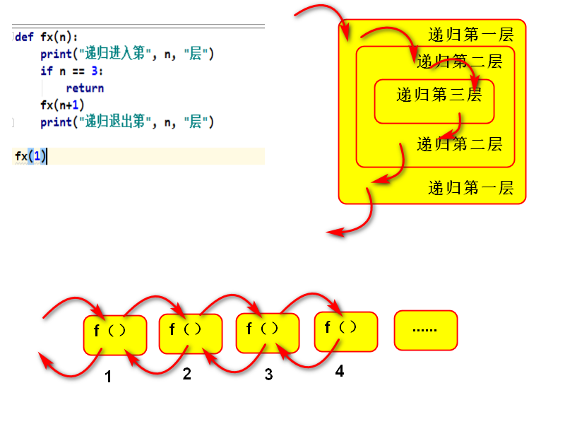

# Functional Programming 函数式编程

## Lambda表达式

创建一个匿名函数对象，同def类似，但无需提供函数名

```python
# 定义匿名函数
变量 = lambda 形参: 方法体

# 调用
变量(实参)
```

作用：作为参数传递时语法简洁优雅，代码可读性强。随时创建，随时销毁

说明：

- 形参没有可以不填

- 方法体只能有一条语句，且不支持赋值语句

```python
myadd = lambda x, y: x + y
print(myadd(2, 3))  # 5

# ----------------------------------------------------------
def fx(f, x, y):
    print(f(x, y))
    
fx((lambda x, y: x + y), 1, 2)  # 3
fx((lambda x, y: x * y), 3, 4)  # 12
```


## 函数式编程

指用一系列函数解决问题

函数本身可以赋值给变量，赋值后的变量绑定函数，函数可以作为参数传递给另一个函数，也可以返回一个函数

参考微软的LINQ


### 函数作为参数传递

将核心逻辑传入方法体，使该方法的适用性更广，体现了面向对象编程的开闭原则

```python
def f1():
    print("f1被调用")
    
fx = f1
fx()  # 等同于f1()

# -------------------------------------------------------------
def f1():
    print("f1被调用")
    
def f2(func):
    print("f2被调用")
    func()
    
f2(f1)  # 将f1作为参数传给f2()

# ------------------------------------------------------------
def fx(lst, fn):
    return fn(lst)

L = [5, 9, 4, 6]
print("最大值是:", fx(L, max))
```


### 函数作为返回值

```python
def get_fx():
    s = input("请输入操作:")
    if s == "求最大":
        return max
    elif s == "求最小":
        return min
    elif s == '求和':
        return sum
    
L = [1, 2, 3, 4, 5]
f1 = get_fx()
print(f1())
```


## python 内部高阶函数

高阶函数 HighOrder Function

满足下列条件的函数即为高阶函数：

1. 函数接收一个或多个函数作为参数传入
2. 函数返回一个函数


### map(function, *iterables)

用函数和可迭代对象中的每个元素作为参数计算出新的可迭代对象并返回。当最短的可迭代对象不再提供数据时，新可迭代对象生成结束

```python
def pow2(x):
    return x ** 2

for x in map(pow2, range(1, 10)):
    print(x)
    
# ---------------------------------------------------------------------
for x in map(pow, range(10), range(4, 0, -1)):
    print(x)
```

说明：

- function函数的形参个数与map函数中可迭代对象的个数相关，一般function函数的形参个数等于map函数中可迭代对象的个数
- map函数可以用列表推导式代替


### filter(function, iterable)

根据条件筛选可迭代对象中的元素，返回值为新可迭代对象

```python
def is_odd(x):
    return x % 2 == 1

for x in filter(is_odd, range(10)):
    print(x)
    
# ----------------------------------------------------------------
even = [x for x in filter(lambda x: x % 2 == 0, range(10))]
print(even)
```

说明：

- 函数func对每个元素，进行求值，返回false则将此数据抛弃，返回True则保留数据
- filter函数也可以用列表推导式代替


### sort(iterable, key=None, reverse=False)

将原可迭代对象的数据进行排序，生成排序的列表

```python
L = [0, 1, -2, 3, -4, 5]
for i in sorted(L, key=abs):
    print(i)
    
for i in sorted(L, key=abs, reverse=True):
    print(i)
```

说明：

- key 函数是用来提供一个参考值，将作为可迭代对象的排序依据，要用关键字传参
- reverse 标志用来设置是否降序排序，要用关键字传参


### max(iterable, key=函数)

根据函数获取可迭代对象最大值

### min(iterable, key=函数)

根据函数获取可迭代对象最小值


## 执行函数

### eval(source, global=None, locals=None)

把一个字符串当成一个表达式执行，返回表达式执行的结果

```python
x = 1
y = 2
a = eval('x + y')
print(a)  # 3
```

### exec(source, global=None, locals=None)

把一个字符串当成程序执行

```python
x = 1
y = 2
s = 'z=x+y; print(z); del z; print("删除成功")'
exec(s)
```


## 递归函数 Recursion

函数直接或间接调用自身

```python
# 直接调用自身
def fn():
    ...
    fn()
    ...
 
fn()

# 间接调用自身
def fa():
    ...
    fb()
    ...
    
def fb():
    ...
    fa()
    ...
    
fa()
```

说明：

- 递归一定要控制递归的层数，当符合某一条件时要终止递归

- 几乎所有的递归都可用while循环来代替

```python
def fx(n):
    print("递归进入第", n, "层")
    if n == 3:
        return 
    fx(n+1)
    print("递归进入第", n, "层")
    
fx(1)

# ----------------------------------------------------------
def mysum(x):
    if x <= 1:
        return 1
    return x + mysum(x-1)

print("1+2+3+...+100=", mysum(100))  # 1+2+3+...+100= 5050
```



- 优点
  - 可以把问题简单化，让思路更清洗，代码更简洁

- 缺点
  - 系统环境影响大，当递归深度太大时，可能会造成不可预知后果


递归函数的实现方法：

1. 先假设上一步已经实现
2. 设定递归结束条件


## 闭包 closure

将内嵌函数语句和这些语句的执行环境打包在一起，得到的对象称为闭包

闭包三要素：

- 必须有一个内嵌函数
- 内嵌函数必须引用外部函数中的变量
- 外部函数返回值必须是内嵌函数

```python
def 外部函数名(参数):
    外部变量
    
    def 内部函数名(参数):
        使用外部变量
        
    return 内部函数名

# 调用
变量 = 外部函数名(参数)  # 此时变量绑定内部函数
变量(参数)
```

```python
def make_power(y):
    def fx(arg):
        return arg ** y
    return fx

pow2 = make_power(2)
print("3 ** 2 =", pow2(3))  # 3 ** 2 = 9

pow3 = make_power(3)
print("4 ** 3 =", pow3(4))  # 4 ** 3 = 64

# 1**2 + 2**2 + ... + 9**2 = 285
print(sum(map(make_power(2), range(10))))
```

定义：在一个函数内部的函数，同时内部函数又引用外部函数的变量

本质：闭包是将内部函数和外部函数的执行环境绑定在一起的对象

优点：内部函数可以使用外部变量

缺点：外部变量一直存在于内存中，不会再调用结束后释放，占用内存

作用：在面向过程和函数式编程中有广泛应用，但在Python中主要用做装饰器


## 装饰器 decorators

在不改变原函数的调用以及内部代码的情况下，为其添加新功能的函数

```python
def 函数装饰器名称(func):
    def 内嵌函数名(*args, **kwargs):
    	需要添加的新功能
        return func(*args, **kwargs)
    return 内嵌函数名

# 使用
def 原函数名(参数):
    函数体

# 调用装饰后的函数
原函数(参数)
```

```python
def mydeco(func):
    def wrapper(*args, **kwargs):
        print("Hello ", end='')
        func(*args, **kwargs)
    return wrapper

@mydeco
def myfunc(s):
    print(s)
    
myfunc("World")  # Hello World
myfunc("Python")  # Hello Python
```

本质：

使用@函数装饰器名称修饰原函数，等同于：

```python
原函数名 = 函数装饰器名称（原函数名）
# 创建与原函数同名的变量，关联内嵌函数，故调用原函数时执行内嵌函数
```

装饰器链：

一个函数可以被多个装饰器修饰，执行顺序从近到远