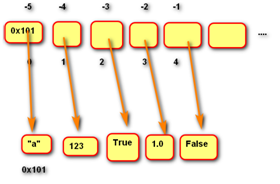
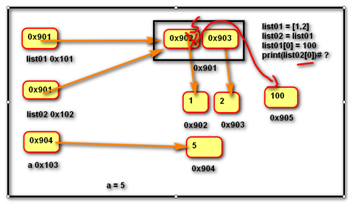
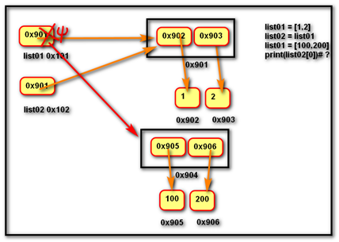
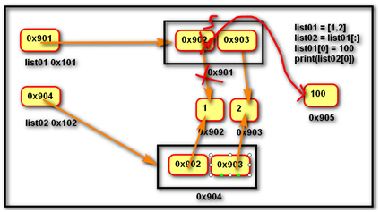
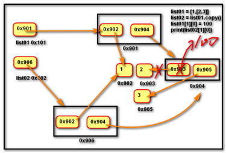
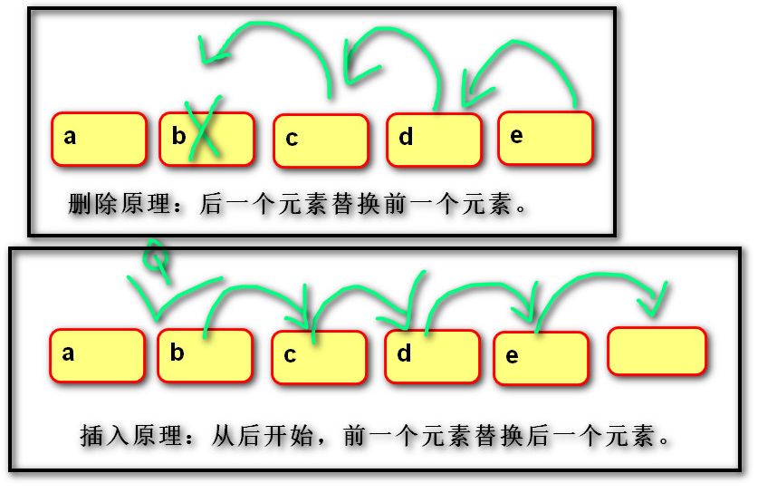

# list 列表

## 定义

由一系列变量组成的可变序列容器

```python
# 列表的表示方法
# 用 [] 括起来的内容
# 空列表
[]
# 非空列表
[1, 2, 3, 'a', 'python', '汉字']
```



列表与字符串的比较

|                    | str                          | list                       |
| ------------------ | ---------------------------- | -------------------------- |
| 是否有序           | √                            | √                          |
| 是否可变           | ×                            | √                          |
| 元素               | 字符串中每个元素存储的是字符 | 列表中可以存储任意类型对象 |
| 是否属于可迭代对象 | √                            | √                          |
| 索引切片取值       | √                            | √                          |
| 索引切片赋值       | ×                            | √                          |


## 列表的增删改查

```python
# 创建
# 创建空列表
L = []
# 创建非空列表
L = [1, 2, 3]

# 列表的构造函数
list()  # 生成一个空列表，等同于[]
list(iterable)  # 用可迭代对象创建列表

# 增加
# 在末尾增加单个元素
L.append(x)
# 利用索引在指定位置插入单个元素
L.insert(index, x)
# 向某列表追加另一个列表
L.extend(lst)

# 删除
# 利用方法删除指定元素
L.remove(x)
# 利用索引删除指定位置元素
del L[index]
L.pop(index)

# 修改
# 利用索引和切片赋值
L[index] = 表达式
L[slice] = 可迭代对象
# 索引赋值
L = [1, 2, 3]
L[0] = [1.1, 1.2]  # L = [[1.1, 1.2], 2, 3]
# 切片赋值
L = [1, 2, 3]
L[0:1] = [1.1, 1.2]  # L = [1.1, 1.2, 2, 3]

# 查看
# 利用索引和切片取值
a = L[index]
lst = L[slice]
```

说明：

- 列表切片赋值的右侧必须是可迭代对象
- 列表 __索引赋值__ 是修改对应的元素
- 列表 __切片赋值__ 是用右侧可迭代对象替换切片内容
- 列表切片赋值的起止值相同，则在索引处插入右侧内容
- 如果切片步长为1，则右侧可迭代对象个数可以不等于左侧切片个数
- 如果切片步长不为1，则右侧可迭代对象个数可以必须等于左侧切片个数

```python
# 注意
L = [1, 2, 3]
L[:] = []  # 清空列表，将列表所有元素切出来，并赋值为空，改变原列表数据
L = []  # 将空列表赋值给L，原列表数据不变
```


## 列表常用方法

| 方法                        | 说明                                                         |
| --------------------------- | ------------------------------------------------------------ |
| 查找                        |                                                              |
| L.index(v [, begin[, end]]) | 返回对应元素的索引下标, begin为开始索引，end为结束索引,当 value 不存在时触发ValueError错误 |
| __L.count(x)__              | 用于统计某个元素在列表中出现的次数                           |
| 删除                        |                                                              |
| **L.pop([index])**          | 删除索引对应的元素，如果不加索引，默认删除最后元素，同时返回删除元素的引用关系 |
| **L.remove(x)**             | 从列表中删除第一次出现在列表中的值                           |
| L.clear()                   | 清空列表, 等同于 L[:] = []                                   |
| 增加                        |                                                              |
| **L.insert(index, obj)**    | 将某个元素插放到列表中指定的位置                             |
| **L.extend(lst)**           | 向列表追加另一个列表                                         |
| **L.append(x)**             | 向列表追加单个元素                                           |
| 拷贝                        |                                                              |
| L.copy()                    | 复制此列表（只复制一层，不会复制深层对象)                    |
| 排序                        |                                                              |
| **L.sort(reverse=False)**   | 将列表中的元素进行排序，默认顺序按值的小到大的顺序排列       |
| **L.reverse()**             | 列表的反转，用来改变原列表的先后顺序                         |


## 浅拷贝和深拷贝









Python的变量与对象是绑定关系，变量并不存储对象的数据，变量里面存的是绑定的对象的地址

- 浅拷贝：在复制过程中，只复制一层变量。不会复制深层变量绑定的对象
- 深拷贝：在复制过程中，复制所有变量及变量关联的深层变量的绑定的对象，实现两个对象完全独立

```python
L2 = L1  # 并不是复制，而是让L2也绑定与L1绑定的列表

# 浅拷贝
L2 = L1[:]  # 利用切片
L2 = L1.copy()  # 利用方法

# 深拷贝
import copy
L2 = copy.deepcopy(L1)
```


## 列表推导式

用可迭代对象依次生成带有多个元素的列表的表达式

```python
[表达式 for 变量 in 可迭代对象]
[表达式 for 变量 in 可迭代对象 if 真值表达式]

# 生成1~9的平方列表
[x**2 for x in range(1, 10)]
# 生成1~9中奇数的平方列表
[x**2 for x in range(1, 10) if x % 2]

# 列表推导式嵌套
[表达式1 for 变量1 in 可迭代对象1 if 真值表达式1
		for 变量2 in 可迭代对象2 if 真值表达式2
		...]

lst1 = ['A', 'B', 'C']
lst2 = [1, 2, 3]
lst = [x+str(y) for x in lst1 for y in lst2]
# ['A1', 'A2', 'A3', 'B1', 'B2', 'B3', 'C1', 'C2', 'C3']

# 打印99乘法表
print('\n'.join(
				[' '.join(
							['%s*%s=%-2s' % (y,x,x*y) for y in range(1,x+1)]
					)
					for x in range(1, 10)]
				)
	)
```


## 列表排序、插入和删除

```python
# 冒泡排序法
L = [ 1, 5, 3, 2, 1, 9, 6]
for i in range(len(L)-1):
    for j in range(len(L)-i-1):
        if L[j] > L[j+1]:
            L[j], L[j+1] = L[j+1], L[j]
            
for i in range(len(L)-1):
    for j in range(i+1, len(L)):
        if L[i] > L[j]:
            L[i], L[j] = L[j], L[i]
```

```python
# 插入
def insert_element(list_target, index, element):
    list_target.append(None)
    for i in range(len(list_target)-1, index, -1):
        list_target[i] = list_target[i-1]
    list_target[index] = element
    
L = [1, 2, 3, 4, 5]
insert_element(L, 1, 10)
print(L)
```

```python
# 倒序删除
# 不借助新列表
def delete_element(list_target):
    for i in range(len(list_target)-1, -1, -1):
        if list_target.count(list_target[i]) > 1:
            del list_target[i]  # 删除后面的重复元素
            # list_target.remove(list_target[i])  # 删除前面的重复元素

L = [1, 2, 4, 5, 4, 9, 8, 7, 8, 4, 4]
delete_element(L)
print(L)
```

```python
# 借助新列表
# 往新列表中添加不存在的元素
L = [1, 2, 4, 5, 4, 9, 8, 7, 8, 4, 4]
new_L = []
for i in L:
    if i not in new_L:
        new_L.append(i)
```

```python
# 最简单的删除集合重复元素的方法，借助集合元素唯一性
L = [1, 2, 4, 5, 4, 9, 8, 7, 8, 4, 4]
s = set(L)
L = list(s)
# numpy.unique() 也有去重功能
L = numpy.unique(L)
```

```python
# 不使用列表方法，删除集合元素
# 先排序，再比较相邻元素，相同则删除
def bubble_sort(L):
    for i in range(len(L)-1):
        for j in range(len(L)-i-1):
            if L[j] > L[j+1]:
                L[j], L[j+1] = L[j+1], L[j]

def delete_element(L):
    last = L[-1]
    # 倒序删除
    for i in range(len(L)-2, -1, -1):
        if last == L[i]:
            del L[i]
        else:
            last = L[i]
            
L = [1, 2, 4, 5, 4, 9, 8, 7, 8, 4, 4]
bubble_sort(L)
delete_element(L)
```



