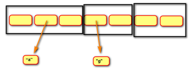

# set 集合

## 定义

由一系列**不重复**的**变量**组成的**可变** **映射** 容器。



说明：

- 相当于**只有键没有值的字典**

- 集合本身是**可变容器**，可以删除和增加元素

- 集合的**元素是不可变对象**，不能把列表和字典作为集合元素，无法修改集合元素


## 集合基础操作

```python
# 表示方法
用 {} 括起来，每个元素用，分隔
# 注意空集合的表示方法
# 空集合
set()
# 非空集合
{1, 2, 3, 'hello', (4, 5)}

# 创建
# 创建非空集合
s = {1, 2, 3, 'hello', (4, 5)}
# 集合构造函数 set()
# 利用科跌打对象创建集合
set(iterable)
# 创建空集合
s = set()

# 增加
# 把x加入到集合s中；如果已经存在 ，则不添加
s.add(x)
# 删除
# 从集合s中删除一个元素；若不存在，则产生一个KeyError
s.remove(x)
# 从集合s中删除一个元素；若不存在，什么都不做，不会报错
s.discard(x)
```

注意：

- **集合没有索引和切片**，**集合元素不能修改**，所以**集合没有修改**和**查找**

- 同字典一样，**集合没有算术运算**

- **访问集合元素** **也只能借用for循环**


## 集合逻辑运算

| 运算符 | 运算     | 示例            | 说明                                                   |
| ------ | -------- | --------------- | ------------------------------------------------------ |
| **&**  | 交集     | s01 **&** s02   | 求两个集合共同部分                                     |
| **\|** | 并集     | s01 **\|** s02  | 两个集合合并，并去重                                   |
| **-**  | 补集     | s01 **-**   s02 | 返回s01有，但是s02没有的部分                           |
| **^**  | 对称补集 | s01 **^** s02   | 返回不是共有的部分，相当于s01 -   s02   \|   s02 - s01 |
| **<**  | 子集     | s01  **<** s02  | 判断一个集合是另一个集合的子集，返回值为bool值         |
| **>**  | 超集     | s01  **>** s02  | 判断一个集合是另一个集合的超集，返回值为bool值         |


## 集合常用方法

| 方法               | 说明                                                         |
| ------------------ | ------------------------------------------------------------ |
| **add(**x**)**     | 向集合添加一个新元素；若已存在，则不添加                     |
| copy()             | 拷贝一个集合                                                 |
| **clear()**        | 移除集合中的所有元素                                         |
| pop()              | 随机移除元素，返回删除的元素；若集合为空，则引发KeyError错误 |
| update(s)          | 用s与原集合全集更新集合，并改变绑定关系                      |
| **remove(**x**)**  | 从集合s中删除一个元素；若不存在，则产生一个KeyError          |
| **discard(**x**)** | 从集合s中删除一个元素；若不存在，什么都不做，不会报错        |


## 集合推导式

```python
{表达式 for 变量 in 可迭代对象}
{表达式 for 变量 in 可迭代对象 if 真值表达式}
```


## 固定集合 Frozenset()

不可变的集合

```python
# 固定集合表示方法
# 空固定集合
frozenset()
# 非空固定集合
frozenset({1, 2, 3, 'hello', '中文', (7, 'a')})

# 固定集合构造函数 frozenset()
# 创建空固定集合
fs = frozenset()
# 用可迭代对象创建非空固定集合
fs = frozenset(iterable)
```

说明：

- 固定集合不能增删改查
- 逻辑运算与集合相同