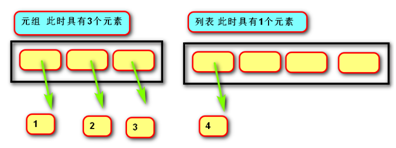

# tuple 元组

## 定义

由一系列**变量**组成的**不可变**序列容器。



说明：

- 元组是**不可变**容器，**不能改变元组元素**。但是如果**元组的某个元素是列表，则可以改变该列表的元素，但是依然没有改变元组的元素**。
- 元组在创建时就固定了不可改变，不同于列表。
- 元组与列表都可以存储一系列变量。
- 列表会预留内存空间，所以可以增加。
- 元组会按需分配内存，建议变量数据固定时使用元组，因为通常占用空间小


## 元组基本操作

```python
# 表示方法
# 空元组
()
# 非空元组
(2,)
(1, 2, 3, 'hello', '中')
# 元组在创建过程中要有逗号，表示过程中要有括号

# 创建
# 创建空元组
t = ()
# 创建非空元组
t = 2,
t = (2,)
t = 1, 2, 3
t = (1, 2, 3, 'hello', '中')

# 错误示例
t = (20)  # t绑定数字20，此例子中小括号只是将数字括起来
x, y, z = 1, 2, 3  # 序列赋值
x, y, z = 'abc'  # 序列赋值, x='a',  y='b', z='c'
x, y, z = (1, 2, 3)  # 序列赋值
x, y, z =[1, 2, 3]  # 序列赋值

# tuple() 元组构造函数
tuple()  # 生成空元组
tuple(iterable)  # 用可迭代对象生成元组

# 元组是不可变对象，所以元组无法增加、删除、修改元素
# 元组只能查找元素
# 元组同其他容器一样，利用索引和切片取值
t[index]
t[slice]
```


## 元组方法

| 方法                       | 说明                       |
| -------------------------- | -------------------------- |
| t.count(x)                 | 用于获取元组中某元素的个数 |
| t.index(v[, begin[, end]]) | 返回某元素的索引           |

