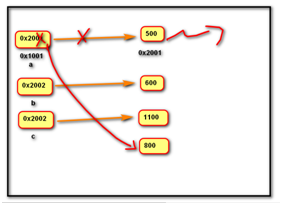

# Variable

## 变量

定义：关联一个对象的标识。变量本身有一个地址，变量里面存的是绑定的对象的地址。类似于C语言的指针

注意：变量本身不存储数据，不同于C语言



```python
a = 500
b = 600
c = 1100
a = 800  # 此时500没有变量绑定，被系统自动回收
```


### Python命名规则

- 必须为**字母**或**下划线**开头，后面跟着字母，数字，下划线
- 不能使用保留关键字
- 见名知意，字母小写，多个单词用下划线隔开


### Python垃圾回收机制

当一个对象的引用计数为0时，对象会被系统自动回收，对象占用的内存空间会被释放

### 小整数对象池

在CPython中整数-5到256，永远存在小整数对象池中，不会被释放。对象池是Python的缓存机制


### 赋值语句

- 变量名  = 表达式
- 变量名1 = 变量名2 = 表达式
- 变量名1，变量名2  =表达式1，表达式2  （序列赋值）


## 常量 Const

Python中的常量一般定义在开头，字母全大写

```python
HOST = '127.0.0.1'
PORT = 10000
ADDR = (HOST, PORT)
```


## 数据类型 DataType

- 数字
  - 整型 __int__
    - 整数，包含正数、负数、0
    - 字面值
      - 十进制 100 -5 0
      - 二进制 0b0, 0b10
      - 八进制 0o7, 0o10
      - 十六进制 0xa, 0x1F
  - 浮点型 __float__
    - 小数，包含正数、负数、0.0
    - 字面值
      - 小数 3.14，-1.5
      - 科学计数法 1.5e1， 0.5E-1
  - 复数 __complex__
    - 由实部和虚部组成的数字，虚部以 __j__ 和 __J__ 结尾
    - 字面值 5+3j、5J
- 布尔型数 __bool__
  - 用来表示真假两种状态
  - 字面值
    - __True__ 表示真
    - __False__ 表示假
- 空值 __None__
  - 表示不存在的特殊对象
  - 作用
    - 用来占位 a = None
    - 变量解除绑定


在Python中变量没有类型，关联的对象有类型，可以通过type方法，判断对象的类型 `type(obj)`


### 数值类型的构造函数

- __int(obj=0, base)__
  - 将字符串或数字转换为整数，如果不给参数则返回0
  - base是进制转换的底数
- __float(obj)__
  - 将字符串或数字转换为浮点数
- __complex(r=0.0, i=0.0)__
  - 用数字创建一个复数，r为实部，i为虚部
- __bool(obj)__
  - 用对象创建一个布尔值
  - bool返回False的情况：
    - None
    - False
    - 0, 0.0, 0j 所有数字零
    - '', [], (), {}, set() 所有空容器


# 运算符

| 运算符类别         | 运算符                   |                                                              |
| ------------------ | ------------------------ | ------------------------------------------------------------ |
| 算术运算符         | `+ - * / // % **`        |                                                              |
| 复合赋值算术运算符 | `+= -= *= /= //= %= **=` |                                                              |
| 比较运算符         | `> >= < <= == !=`        |                                                              |
| 逻辑运算符         | `and/or/not`             | Python逻辑运算符遵循短路逻辑                                 |
| 一元运算符         | `+ -`                    |                                                              |
| 身份运算符         | `is/is not`              | 判断两个对象是否同一对象，即地址是否相同。可以利用 `id(obj)` 获取一个对象的内存地址 |
| 位运算符           |                          |                                                              |

运算符优先级：

`小括号 > 算术运算符 > 比较运算符 > 复合赋值运算符 > 逻辑运算符`


## 内建函数

预置数值型函数

| 函数                   | 功能                        | 参数                                                         |
| ---------------------- | --------------------------- | ------------------------------------------------------------ |
| abs(x)                 | 取x的绝对值                 |                                                              |
| round(number, ndigits) | 对number进行四舍五入        | ndigits是小数取整的位数，即精度。负数表示向左取整，默认为0， |
| pow(x, y, z=None)      | 幂运算，相当于`x**y/x**y%z` |                                                              |

输入输出函数

| 函数                                  | 功能                                                         |
| ------------------------------------- | ------------------------------------------------------------ |
| input("提示信息")                     |                                                              |
| print(values, ..., sep=' ', end='\n') | sep是两个值间的分隔符，默认为空格；end为输出完毕后在末尾追加的内容，默认为换行符 |

| 函数      | 功能                   |
| --------- | ---------------------- |
| type(obj) | 判断对象的数据类型     |
| id(obj)   | 获取对象在内存中的地址 |

