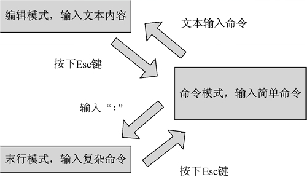

Vim
===

VIM有3种基本工作模式
---

### 命令行模式,Normal Mode/Command Mode:

* 进入VIM后的默认模式.任何时候不管处于何种模式,都可以按下 __`ESC`__ 键进入命令行模式 
* 在命令模式下,用户可以输入VIM命令,用于管理自己的文档.此时从键盘上输入的任何字符都被当作编辑命令来解释.命令不会在屏幕上显示.如果输入的命令不合法则报警

### 文本输入模式Insert Mode: 

* 在命令模式下输入 __插入命令`i`,附加命令`a`,打开命令`o`,修改命令`c`,取代命令`r`,替换命令`s`__ 都可以进入文本输入模式
* 在文本输入模式下,用户输入的任何字符都会被当作文件内容保存起来,并显示在屏幕上

### 末行模式Command-Line Mode: 按 `:` 进入,执行一些特殊\高级命令

* 在命令模式下,按 __`:`__ 键进入末行模式,此时VIM会在显示窗口的最后一行,显示一个`:`作为末行模式的说明符,等待用户输入命令
* 末行模式通常执行一些特殊或高级命令,多数文件关联命令都是在此模式下执行的
* 末行命令执行完后,VIM自动回到命令模式

常用命令:

command|meaning
-|-
VIM|进入vim
VIM filename|打开或新建一个文件
VIM + filename|打开文件,并且光标处于文件最后一行
VIM +/模式字符串 filename|打开文件,光标处于文件中第一个与指定模式字符串匹配的那行上
VIM 需要打开文件的通配符|vim同时编辑多个文件|`vim *.c`
:q!|强制退出
:wq|保存并退出
ZZ|保存并退出
:open filename|带开文件

Normal Mode Commands
---

navigate:

commands|meaning
-|-
h|move left
j|move down
k|move up
l|move right
-|-
Crtl-f|page down
Ctrl-b|page up
-|-
w|move forward by word
W|move forward by word using white space as word boundaries
b|move backward by word
B|move backword by word using white space as word boundaries
-|-
z<ENTER>|move your view up
0|go to the beginning of line
^|go to the beginning of character
$|go to the end of line
-|-
1gg|go to the very beginning of the file
gg|go to the very beginning of the file
G|go to the very end of the file
$G|go to the very end of the file
<LINE_NUMBER>gg or <LINE_NUMBER>G|go to a specific line
-|-
Ctrl-g|to view how many lines in the file
g-Gtrl-g|get more infomation about where is the cursor
.|repeat the previous command

delete:

command|meaning
-|-
x|delete the character at the cursor
X|delete the character before the cursor
d-w|to delete a word at the cursor
d-W|to delete words ignore punctuate
d-$|delete words from cursor to the end of the line
D|delete words from cursor to the end of the line
dd|delete the whole line
5dw|number-the count, how many times to repeat the command
3w|repeat word motion 3 times
d3w|delete the 3w motion
2d3w|delete the 3w motion 2 times

command = [count]operation[count]{motion}

Line Mode
---

commands|meaning
-|-
:32<ENTER>|go to line 32
:$<ENTER>|go to the last line
-|-
:set ruler|open the ruler
:set noruler|close the ruler
:set ruler!|open or close the ruler
:set nohlsearch|取消高亮显示
:w<ENTER>|save file and return to Normal mode

### VIM打开文件

命令|说明
-|-
VIM filename|打开或新建一个文件,并将光标置于第一行行首
VIM -r filename|恢复上次vim打开时崩溃的文件
VIM -R filename|把指定文件以只读方式打开
VIM + filename 打开文件,并将光标置于最后一行行首
VIM +n filename|打开文件,并将光标置于第n行的行首
vim +/pattern filename|打开文件,并将光标置于第一个与pattern匹配的位置
vim -c command filename|对文件进行编辑前,先执行指定的命令
:open filename|打开或新建一个文件

## 文本模式

* 插入文本命令 i I
  * i 将文本插入到光标所在位置前
  * I 将文本插入当前行的行首
* 追加文本命令 a A
  * a 将文本追加到光标当前所在位置后
  * A 将文本追加到所在行的行尾
* 空行插入命令 o O
  * o 在光标所在行的下面插入一个空行,并将光标置于该行行首
  * O 在光标所在行的上面插入一个空行,并将光标置于该行行首

## 文本删除命令

命令|意义
-|-
x|删除光标处的字符
5x|删除从光标所在位置开始向右的5个字符
X|删除光标前面的字符
3X|删除从光标前面字符开始向左的3个字符
dd|删除当前行
D|删除光标所在处到行尾的内容
d$|删除光标所在处到行尾的内容
d0|删除光标前一个字符到行首的内容
dw|删除一个单词.若光标在某个词的中间,则从光标所在位置删至词尾
d(|删除到上一句开始的所有字符
d)|删除到下一句开始的所有字符
d{|删除到上一段开始的所有字符
d}|删除到下一段开始的所有字符
d-回车|删除包括当前行在内的两行字符
:n1,n2d|删除从n1行到n2行的文本内容

### 文本复制命令

命令|命令意义
-|-
yy|复制光标所在的整行
Y|复制从光标开始到行尾的内容
y$|复制从光标开始到行尾的内容
y0|复制光表前一个字符到行首的内容
yw|复制一个单词,若光标处于某个单词中间,则从光标所在位置复制至词尾
y(|复制到上一句的开始
y)|复制到下一句的开始
y{|复制到上一段的开始
y}|复制到下一段的开始
y-回车|复制包括当前行在内的两行
p|粘贴命令,粘贴当前缓冲区的内容
v|文本选择命令,在需要选择的文本的起始处按下v键进入块选择模式,然后移动光标至块尾处,这之间的部分内容被高亮,表示选中
V|文本选择命令,在需要选择的文本的第一行按下V键进入块选择模式,然后移动光标至块尾的最后一行,这之间的部分内容被高亮,表示选中

### 撤销命令

* u : 撤销上一次所做的所有操作.多次使用u命令,会一步一步撤销之前的操作.注意:在一次切换到文本输入模式中输入的所有文本算一次操作
* U : 一次性撤销自上次移动到当前行以来做过的所有操作,再使用一次U命令,则撤销之前的U命令所做的操作,恢复被撤销的内容

### 重复命令

. : 在命令模式下使用,重复执行刚使用的命令

### 退出命令

* :q 在末行模式下输入,退出VIM.如果退出时当前编辑的文件尚未保存,则vim并不退出,而是继续等待用户输入命令,并且会在显示窗口的末行报警
* :q! 强制退出,无论文件是否修改都会退出VIM
* :w 保存当前编辑的文件,但是并不退出,而是回到命令模式
* :w filename 将文件另存为一个新文件.若另存为的文件已经存在,则会给出提示信息
* :w! 强制保存文件
* :w! filename 将文件另存为一个新文件,即使指定新文件存在,也会直接替换该文件,
* :wq 保存并退出.如果当前文件未命名,则需指定一个文件名
* :x 若当前文件曾被修改过,则会保存该文件;否则直接退出,不保存该文件
* x! 保存文本,并退出VIM
* ZZ 直接退出VIM

### 替换命令

* r 将当前光标所指的字符替换为提供的字符.可以在该命令前加上数字n,表示从当前字符开始的n个字符替换为提供的字符.e.g. `4rb` b为提供的字符
* R VIM进入replace模式,在此模式下,每个输入的字符都会替换当前光标下的字符,直到按下ESC退出该模式

### 光标移动命令

* j 光标下移一行
* k 光标上移一行
* h 光标左移一个字符
* l 光标右移一个字符
* H 将光标移动到当前屏幕的第一行,而不是文件的第一行.若在H前加上数字,则将光标移至第n行的行首
* M 将光标移动到当前屏幕的中间行的行首
* L 将光标移动到当前屏幕的最底行的行首
* G 在全文范围内移动光标.G表示移动至文本最后一行,5G则移动至文本第5行的行首
* w 将光标移动至下一个词的词首,包括标点和非英文字符
* W 将光标移动至下一个词的词首,忽略标点和非英文字符
* e 如果光标位于字内,则将光标移至词尾;如果光标位于词尾,则将光标移至下一个词词尾,包括标点和非英文字符
* E 如果光标位于字内,则将光标移至词尾;如果光标位于词尾,则将光标移至下一个词词尾,忽略标点和非英文字符
* b 如果光标位于字内,则将光标移至词首;如果光标位于词首,则将光标移至下一个词词首,包括标点和非英文字符
* B 如果光标位于字内,则将光标移至词首;如果光标位于词首,则将光标移至下一个词词首,忽略标点和非英文字符
* { 将光标移动到当前段落的开头,段落是指以空白行开始和结束的片段
* } 将光标移动到当前段落的结尾
* % 适用于() [] {},在匹配的括号间移动

### 文本移动命令

* > 将指定的正文向右移动,通常右移8个空格
  * >n 将光标所在行和其下n行内容右移动
  * >  将光标所在行和下一行文本右移
  * >0 只右移光标所在行
* < 将指定的正文内容左移
* >> 将光标所在行右移8个空格
  * 4>> 将光标所在行和其下3行(共4行)都右移8个空格
* << 将光标所在行左移8个空格

### 文本跨行移动命令 m

* imj 将第i行移至第j行的下方

### 滚屏和屏幕分页命令

* Ctrl-u 将屏幕向文件头方向滚半屏
* Ctrl-d 将屏幕向文件尾方向滚半屏
* Ctrl-b 将屏幕向文件头方向滚一整屏
* Ctrl-f 将屏幕向文件尾方向滚一整屏

### 字符串检索命令

在末行模式下使用

* /string 从光标处开始向后寻找字符串string
* ?string 从光标处开始向前寻找字符串string
* /^abc 查找以abc为行首的行
* /abc$ 查找以abc为行尾的行
* n 重复上一条检索命令
* N 重复上一条检索命令,但检索方向改变
* g/string 使光标停在第一个检索到string的行首

### 替换命令

`[range]s/s1/s2[option]`

* [range] 表示检索范围
  * 1,10 表示从第1行到第10行
  * % 表示整个文件
  * 1,$ 表示整个文件
  * .,$ 表示当前行到文件尾
  * 省略 表示当前行
* s 为替换命令
* s1 要被替换的字符串
* s2 替换的字符串
* option 表示选项
  * /g 表示在全局文件中进行替换
  * /c 表示在每次替换前需要用户进行确认
  * 省略 表示仅对第一个匹配的字符串进行替换

vim编辑器在执行替换时可以进行简单的模式匹配, e.g. `%s/\<abc/cde` 表示将以abc开头的单词替换为以cde开头

### 窗口切分命令

* :split 文件名 将窗口切分为两部分,下半部分对应原来文件,上半部分对应新打开的文件
* :sp 文件名 将窗口切分为两部分,下半部分对应原来文件,上半部分对应新打开的文件
* :vsplit 文件名 将窗口切分为两部分,右半部分对应原来文件,左半部分对应新打开的文件
* :vs 文件名 将窗口切分为两部分,右半部分对应原来文件,左半部分对应新打开的文件

### 多窗口切换命令

* Ctrl+w, j 移动光标到下一个窗口
* Ctrl+w, k 移动光标到上一个窗口
* Ctrl+w, q 关闭当前窗口
* Ctrl+w, w 移动光标到另一个窗口

### 在不同文件间切换

如果用vim同时打开多个文件,则需要在文件间进行切换

* Ctrl-6 下一个文件
* :bn 下一个文件
* :bp 上一个文件

### 注释

连续行的注释可以采用替换命令 `:起始行,终止行s/^/#/g` e.g. `:1,10s/^/#/g`
取消连续注释则使用: `:起始行,终止行s/^#//g` e.g. `:1,10s/^#//g` 意为将行首的#替换为空.注意,不同语言的注释符号不同,添加`//`注释稍微麻烦点, 命令格式为 `:起始行,终止行s/^/\/\//g`, e.g. `:1,5s/^/\/\//g` 其实就是`/`前要加转义字符`\`

### 设置快捷键

:map
:unmap

### vim 属性设置命令

.vimc是VIM的配置文件,分为系统配置文件和用户配置文件

* 系统配置文件保存在/etc/.vimc
* 用户配置文件位于~/.vimc

命令|说明
-|-
:set fileencodings=utf-8|设置写入文件时的编码格式为utf-8
:set termencoding=utf-8|设置输出到终端时的编码格式为utf-8
:set encoding=utf-8|设置缓存文本,寄存器和VIM脚本的编码为utf-8
:set cursorline|突出当前行

* 行号设置命令
  * :set nu 显示行号
  * :set nonu 不显示行号
* 设置显示命令
  * :set hlsearch 设定搜寻字符串反白显示 
  * :set nohlsearch 设定搜寻字符串不反白显示
* 语法缩进命令
  * :set autoindent 设置程序语法自动缩进
* 文件存储命令
 * :set backup 设置自动存储备份文件
 * :set nobackup 设置不自动存储备份文件
* 显示选项命令
 * :set all 该命令显示所有选项
* 语法高亮命令
 * :syntax on 程序语法高亮显示
 * :syntax off 程序语法不高亮显示
* 大小写区分命令
 * :set ignorecase 忽略大小写
 * :set noignorecase 区分大小写
